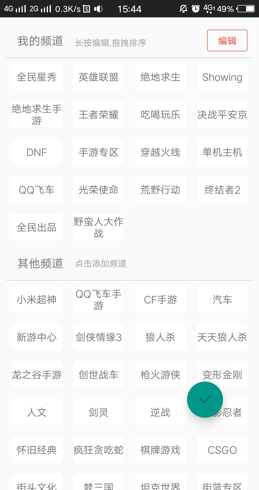

# BeautifulApp
全民直播,使用mvp架构,并且里面有很多东西需要学习 
 

 
 
 

## 用到的开源项目(并不是说我每个都用到了,只是我们可以拿来参考)
 
    //retrofit
    implementation 'com.squareup.retrofit2:retrofit:2.3.0'
    implementation 'com.squareup.retrofit2:converter-gson:2.3.0'
    implementation 'com.squareup.retrofit2:adapter-rxjava2:2.3.0'

    //okhttp
    implementation 'com.squareup.okhttp3:okhttp:3.9.1'
    implementation 'com.squareup.okhttp3:logging-interceptor:3.9.1'

    //rxjava
    implementation 'io.reactivex.rxjava2:rxandroid:2.0.1'
    implementation 'io.reactivex.rxjava2:rxjava:2.1.7'
    implementation 'com.squareup.retrofit2:adapter-rxjava2:2.3.0'

    //stetho调试
    implementation 'com.facebook.stetho:stetho:1.5.0'
    implementation 'com.facebook.stetho:stetho-okhttp3:1.5.0'

    // adapter
    implementation 'com.github.CymChad:BaseRecyclerViewAdapterHelper:2.9.30'

    //glide
    implementation 'com.github.bumptech.glide:glide:4.7.1'
    annotationProcessor 'com.github.bumptech.glide:compiler:4.7.1'
    implementation "com.github.bumptech.glide:okhttp3-integration:4.7.1"

    //圆形图片
    implementation 'de.hdodenhof:circleimageview:2.2.0'

    // 解析html
    implementation 'org.jsoup:jsoup:1.11.2'

    //播放视频
    implementation 'cn.jzvd:jiaozivideoplayer:6.2.3'

    // eventbus
    implementation 'org.greenrobot:eventbus:3.1.1'

    //打造好看的logger
    implementation 'com.orhanobut:logger:2.1.1'

    //各种工具类
    implementation 'com.blankj:utilcode:1.9.12'

    //butterknife
    implementation 'com.jakewharton:butterknife:8.8.1'
    annotationProcessor 'com.jakewharton:butterknife-compiler:8.8.1'

    //检测内存泄漏
    debugImplementation 'com.squareup.leakcanary:leakcanary-android:1.5.4'
    releaseImplementation 'com.squareup.leakcanary:leakcanary-android-no-op:1.5.4'

    // Logger
    implementation 'com.orhanobut:logger:2.1.1'

    //多主题
    implementation 'com.bilibili:magicasakura:0.1.9-beta3@aar'

    //tab
    implementation 'com.flyco.tablayout:FlycoTabLayout_Lib:2.1.2@aar'

    // banner
    implementation 'com.youth.banner:banner:1.4.10'

    //直播
    implementation project(':dkplayer-java')
    implementation 'com.github.dueeeke.dkplayer:dkplayer-armv7a:2.5.2'
    //数据库
    implementation 'org.greenrobot:greendao:3.2.2'

    //

    //EventBus
    implementation 'org.greenrobot:eventbus:3.1.1'

    //

    // 下拉刷新
    implementation 'com.scwang.smartrefresh:SmartRefreshLayout:1.0.5.1'

    implementation 'com.github.chrisbanes:PhotoView:2.0.0'
